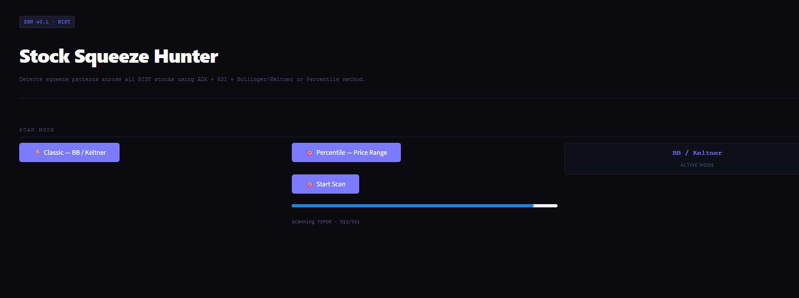
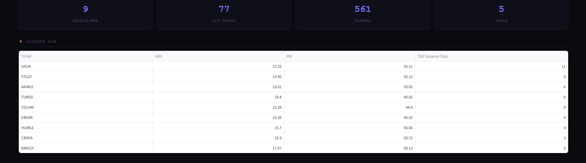
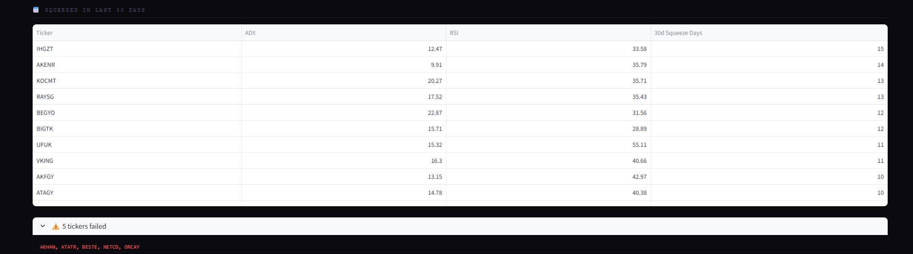
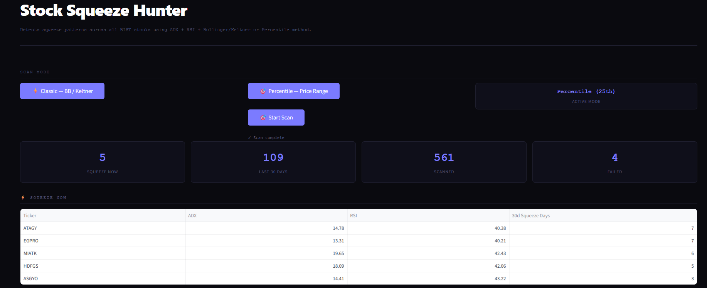

# 🎯 Stock Squeeze Hunter (SSH)

> A technical analysis scanner that detects **squeeze patterns** across all BIST-listed stocks using ADX, RSI, Bollinger Bands, and Keltner Channels.






---

## English

### What is it?
Stock Squeeze Hunter scans all BIST stocks and identifies ones that are in a **volatility squeeze** — a state where price compression often precedes a significant breakout. Two detection modes are available.

### How it works

**Classic Mode — Bollinger / Keltner**
- Bollinger Bands narrow inside Keltner Channels → squeeze detected
- ADX < 20 → no strong trend (price is coiling)
- RSI between 40–60 → momentum is neutral

**Percentile Mode — Price Range**
- Average true range of last 3 days falls below the 25th percentile of the last 20 days
- ADX < 20 + RSI 40–60 conditions still apply

Both modes also check the **last 30 days** for sustained squeeze activity (minimum 3 squeeze days required).

### Installation

```bash
git clone https://github.com/selimpalanduz/stock-squeeze-hunter.git
cd stock-squeeze-hunter
pip install -r requirements.txt
```

### Usage

```bash
streamlit run app.py
```

1. Choose scan mode: **Classic** or **Percentile**
2. Click **Start Scan**
3. View results: stocks in squeeze *right now* and stocks that squeezed in the *last 30 days*

### Requirements

- Python 3.9+
- `yfinance`
- `pandas`
- `ta`
- `streamlit`

### Output

| Column | Description |
|--------|-------------|
| Ticker | BIST stock symbol |
| ADX | Average Directional Index (last value) |
| RSI | Relative Strength Index (last value) |
| 30d Squeeze Days | Number of squeeze days in the last 30 days |

---

## Türkçe

### Nedir?
Stock Squeeze Hunter, tüm BIST hisselerini tarayarak **volatilite sıkışması (squeeze)** yaşayan hisseleri tespit eder. Sıkışma, büyük fiyat hareketlerinden önce sıklıkla gözlemlenen bir fiyat baskısı durumudur. İki farklı tespit modu mevcuttur.

### Nasıl çalışır?

**Klasik Mod — Bollinger / Keltner**
- Bollinger Bantları, Keltner Kanallarının içine daraldığında → sıkışma tespit edilir
- ADX < 20 → güçlü bir trend yok (fiyat sıkışıyor)
- RSI 40–60 arasında → momentum nötr

**Persentil Modu — Fiyat Aralığı**
- Son 3 günün ortalama fiyat aralığı, son 20 günün 25. persentilin altına düştüğünde tespit yapılır
- ADX < 20 ve RSI 40–60 koşulları yine geçerlidir

Her iki mod da **son 30 gün** içinde sürekli sıkışma aktivitesi arar (minimum 3 sıkışma günü gereklidir).

### Kurulum

```bash
git clone https://github.com/selimpalanduz/stock-squeeze-hunter.git
cd stock-squeeze-hunter
pip install -r requirements.txt
```

### Kullanım

```bash
streamlit run app.py
```

1. Tarama modunu seçin: **Klasik** veya **Persentil**
2. **Start Scan** butonuna tıklayın
3. Sonuçları inceleyin: *şu an* sıkışan ve *son 30 günde* sıkışma yaşayan hisseler

### Gereksinimler

- Python 3.9+
- `yfinance`
- `pandas`
- `ta`
- `streamlit`

### Çıktı

| Sütun | Açıklama |
|-------|----------|
| Ticker | BIST hisse sembolü |
| ADX | Ortalama Yön Endeksi (son değer) |
| RSI | Göreceli Güç Endeksi (son değer) |
| 30d Squeeze Days | Son 30 gündeki sıkışma gün sayısı |

---

## 📁 Project Structure

```
stock-squeeze-hunter/
├── app.py          # Streamlit UI
├── ssh.py          # Scanner logic
├── tickers.txt     # BIST ticker list (~561 stocks in 03.08)
├── requirements.txt
└── README.md
```

---

## ⚠️ Disclaimer

This tool is for **informational and educational purposes only**. It does not constitute financial advice. Always do your own research before making investment decisions.

## ⚠️ Sorumluluk Reddi 
Bu proje **Sadece bilgilendirme ve eğitimsel amaçlıdır**.Yatırım tavsiyesi değildir ve içermez.Yatırım kararı alırken her zaman kendi araştırmanızı yapınız.

---

*Built with [yfinance](https://github.com/ranaroussi/yfinance), [ta](https://github.com/bukosabino/ta), and [Streamlit](https://streamlit.io)*